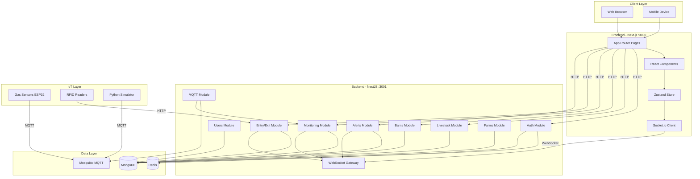

# Design Document: Livestock IoT Monitoring & Management System

## Overview

This design document outlines the technical architecture and implementation details for the Livestock IoT Monitoring & Management System. The system is a full-stack application consisting of a NestJS backend API, Next.js frontend, and Python-based IoT simulator, all orchestrated via Docker Compose.

The system enables real-time monitoring of gas levels in livestock barns through IoT sensors, manages livestock data with QR/RFID tracking, automatically tracks entry/exit activity via RFID, and provides a real-time dashboard for farm monitoring.

## Architecture



## Components and Interfaces

### Backend Modules

#### Auth Module
- **Purpose**: Handle user authentication and authorization
- **Endpoints**:
  - `POST /api/auth/login` - Authenticate user, return JWT tokens
  - `POST /api/auth/refresh` - Refresh access token
  - `GET /api/auth/me` - Get current user profile
- **Dependencies**: Users Module, Redis (token blacklist)
- **Guards**: JwtAuthGuard, RolesGuard

#### Users Module
- **Purpose**: Manage user accounts
- **Endpoints**:
  - `POST /api/users` - Create user (admin only)
  - `GET /api/users` - List users (admin only)
  - `GET /api/users/:id` - Get user details
  - `PUT /api/users/:id` - Update user
  - `DELETE /api/users/:id` - Deactivate user
- **Dependencies**: Auth Module for guards

#### Livestock Module
- **Purpose**: Manage livestock records
- **Endpoints**:
  - `POST /api/livestock` - Create livestock
  - `GET /api/livestock` - List livestock with pagination/filtering
  - `GET /api/livestock/:id` - Get livestock details
  - `PUT /api/livestock/:id` - Update livestock
  - `DELETE /api/livestock/:id` - Soft delete livestock
  - `GET /api/livestock/qr/:qrCode` - Public endpoint for QR scan
  - `POST /api/livestock/:id/photos` - Upload photos
- **Dependencies**: Barns Module, Entry/Exit Module

#### Barns Module
- **Purpose**: Manage barn records and sensor assignments
- **Endpoints**:
  - `POST /api/barns` - Create barn
  - `GET /api/barns` - List barns
  - `GET /api/barns/:id` - Get barn details
  - `PUT /api/barns/:id` - Update barn
  - `DELETE /api/barns/:id` - Delete barn
  - `GET /api/barns/:id/livestock` - Get livestock in barn
  - `POST /api/barns/:id/sensors` - Assign sensor to barn
- **Dependencies**: Livestock Module, Monitoring Module

#### Monitoring Module
- **Purpose**: Handle gas sensor data and thresholds
- **Endpoints**:
  - `GET /api/monitoring/readings` - Get historical readings
  - `GET /api/monitoring/latest` - Get latest readings per sensor
  - `GET /api/monitoring/sensor/:id` - Get readings for specific sensor
- **MQTT Topics**:
  - `sensors/gas/+` - Subscribe to gas sensor data
- **Dependencies**: Alerts Module, WebSocket Gateway

#### Entry/Exit Module
- **Purpose**: Track livestock movement via RFID
- **Endpoints**:
  - `POST /api/logs` - Create entry/exit log (from RFID device)
  - `GET /api/logs` - List logs with filtering
  - `GET /api/logs/livestock/:id` - Get logs for specific livestock
  - `GET /api/logs/barn/:id` - Get logs for specific barn
- **Dependencies**: Livestock Module, Barns Module, WebSocket Gateway

#### Alerts Module
- **Purpose**: Manage system alerts and notifications
- **Endpoints**:
  - `GET /api/alerts` - List alerts with filtering
  - `GET /api/alerts/active` - Get active alerts
  - `PATCH /api/alerts/:id/acknowledge` - Acknowledge alert
  - `PATCH /api/alerts/:id/resolve` - Resolve alert
- **Dependencies**: Email Service, WebSocket Gateway

#### Farms Module
- **Purpose**: Manage farm information
- **Endpoints**:
  - `POST /api/farms` - Create farm
  - `GET /api/farms` - List farms
  - `GET /api/farms/:id` - Get farm details with stats
  - `PUT /api/farms/:id` - Update farm
- **Dependencies**: Users Module

#### MQTT Module
- **Purpose**: Handle MQTT broker connection and message processing
- **Subscriptions**:
  - `sensors/gas/+` - Gas sensor readings
- **Dependencies**: Monitoring Module

#### WebSocket Gateway
- **Purpose**: Real-time communication with frontend
- **Events**:
  - `sensor:reading` - New sensor reading
  - `entry-exit:event` - New entry/exit event
  - `alert:new` - New alert created
  - `alert:updated` - Alert status changed
- **Namespaces**: `/monitoring`, `/alerts`, `/logs`

### Frontend Structure

#### Pages (App Router)
- `/login` - Authentication page
- `/` - Dashboard (overview)
- `/livestock` - Livestock list
- `/livestock/new` - Add livestock form
- `/livestock/[id]` - Livestock detail (authenticated)
- `/barns` - Barn list
- `/barns/[id]` - Barn detail
- `/monitoring` - Real-time sensor monitoring
- `/logs` - Entry/exit logs
- `/alerts` - Alert management
- `/settings` - User settings
- `/livestock/public/[qrCode]` - Public livestock view (no auth)

#### Core Components
- `DashboardLayout` - Main layout with sidebar navigation
- `SensorCard` - Display real-time sensor readings
- `AlertBanner` - Display active alerts
- `LivestockTable` - Paginated livestock list
- `BarnOccupancyCard` - Visual barn capacity indicator
- `EntryExitTimeline` - Timeline view of movements
- `GasChart` - Historical gas level charts
- `QRCodeGenerator` - Generate QR code images
- `QRScanner` - Camera-based QR scanning

#### State Management (Zustand)
- `useAuthStore` - Authentication state
- `useMonitoringStore` - Real-time sensor data
- `useAlertsStore` - Active alerts
- `useLogsStore` - Recent entry/exit logs

## Data Models

### User Schema
```typescript
interface User {
  _id: ObjectId;
  email: string;           // unique, indexed
  password: string;        // bcrypt hashed
  fullName: string;
  role: 'admin' | 'farmer';
  status: 'active' | 'inactive';
  farmId?: ObjectId;       // reference to Farm
  createdAt: Date;
  updatedAt: Date;
}
```

### Livestock Schema
```typescript
interface Livestock {
  _id: ObjectId;
  earTagId: string;        // unique, indexed
  qrCode: string;          // UUID, unique, indexed
  species: string;
  name: string;
  gender: 'male' | 'female';
  dateOfBirth: Date;
  weight: number;
  color: string;
  photos: string[];        // URLs
  status: 'active' | 'sold' | 'deceased';
  healthStatus: string;
  currentBarnId?: ObjectId;
  customFields: Record<string, any>;
  farmId: ObjectId;
  createdAt: Date;
  updatedAt: Date;
}
```

### Barn Schema
```typescript
interface Barn {
  _id: ObjectId;
  name: string;
  code: string;            // unique, indexed
  capacity: number;
  currentOccupancy: number;
  sensors: string[];       // sensor IDs
  status: 'active' | 'inactive';
  farmId: ObjectId;
  createdAt: Date;
  updatedAt: Date;
}
```

### GasSensorReading Schema
```typescript
interface GasSensorReading {
  _id: ObjectId;
  sensorId: string;        // indexed
  barnId: ObjectId;        // indexed
  methanePpm: number;
  co2Ppm: number;
  nh3Ppm: number;
  temperature: number;
  humidity: number;
  alertLevel: 'normal' | 'warning' | 'danger';
  timestamp: Date;         // indexed
  expireAt: Date;          // TTL index, 90 days
}
```

### EntryExitLog Schema
```typescript
interface EntryExitLog {
  _id: ObjectId;
  livestockId: ObjectId;   // indexed
  barnId: ObjectId;        // indexed
  eventType: 'entry' | 'exit';
  rfidReaderId: string;
  timestamp: Date;         // indexed
  duration?: number;       // seconds, calculated on exit
  notes?: string;
}
```

### Alert Schema
```typescript
interface Alert {
  _id: ObjectId;
  type: 'gas_level' | 'system' | 'livestock';
  severity: 'info' | 'warning' | 'critical';
  barnId?: ObjectId;
  livestockId?: ObjectId;
  title: string;
  message: string;
  status: 'active' | 'acknowledged' | 'resolved';
  acknowledgedAt?: Date;
  acknowledgedBy?: ObjectId;
  resolvedAt?: Date;
  resolvedBy?: ObjectId;
  farmId: ObjectId;
  createdAt: Date;
}
```

### Farm Schema
```typescript
interface Farm {
  _id: ObjectId;
  name: string;
  ownerId: ObjectId;
  address: string;
  contactInfo: {
    phone?: string;
    email?: string;
  };
  stats: {
    totalLivestock: number;
    totalBarns: number;
    totalSensors: number;
  };
  createdAt: Date;
  updatedAt: Date;
}
```

## Gas Threshold Configuration

```typescript
const GAS_THRESHOLDS = {
  methane: {
    normal: { min: 0, max: 500 },
    warning: { min: 500, max: 1000 },
    danger: { min: 1000, max: Infinity }
  },
  co2: {
    normal: { min: 0, max: 2000 },
    warning: { min: 2000, max: 3000 },
    danger: { min: 3000, max: Infinity }
  },
  nh3: {
    normal: { min: 0, max: 15 },
    warning: { min: 15, max: 25 },
    danger: { min: 25, max: Infinity }
  }
};

function calculateAlertLevel(reading: GasReading): AlertLevel {
  const levels = ['normal', 'warning', 'danger'];
  let maxLevel = 0;
  
  for (const [gas, value] of Object.entries({
    methane: reading.methanePpm,
    co2: reading.co2Ppm,
    nh3: reading.nh3Ppm
  })) {
    const thresholds = GAS_THRESHOLDS[gas];
    if (value >= thresholds.danger.min) maxLevel = Math.max(maxLevel, 2);
    else if (value >= thresholds.warning.min) maxLevel = Math.max(maxLevel, 1);
  }
  
  return levels[maxLevel];
}
```

## MQTT Message Format

### Gas Sensor Reading (Published by ESP32/Simulator)
```json
{
  "sensorId": "GAS-001",
  "barnId": "barn-uuid",
  "methanePpm": 450,
  "co2Ppm": 1800,
  "nh3Ppm": 12,
  "temperature": 28.5,
  "humidity": 65,
  "timestamp": "2026-01-07T10:30:00Z"
}
```

Topic: `sensors/gas/{sensorId}`

## WebSocket Events

### Server to Client
```typescript
// New sensor reading
socket.emit('sensor:reading', {
  sensorId: string,
  barnId: string,
  reading: GasSensorReading,
  alertLevel: 'normal' | 'warning' | 'danger'
});

// Entry/Exit event
socket.emit('entry-exit:event', {
  livestockId: string,
  barnId: string,
  eventType: 'entry' | 'exit',
  timestamp: Date
});

// New alert
socket.emit('alert:new', Alert);

// Alert updated
socket.emit('alert:updated', {
  alertId: string,
  status: 'acknowledged' | 'resolved'
});
```

### Client to Server
```typescript
// Subscribe to barn updates
socket.emit('subscribe:barn', { barnId: string });

// Unsubscribe from barn
socket.emit('unsubscribe:barn', { barnId: string });
```


## Correctness Properties

*A property is a characteristic or behavior that should hold true across all valid executions of a system—essentially, a formal statement about what the system should do. Properties serve as the bridge between human-readable specifications and machine-verifiable correctness guarantees.*

### Property 1: Valid Authentication Returns Tokens
*For any* valid user credentials (email and password), authenticating with those credentials SHALL return a response containing both a non-empty JWT access token and a non-empty refresh token.

**Validates: Requirements 1.1**

### Property 2: Invalid Credentials Error Uniformity
*For any* authentication attempt with invalid credentials (wrong email, wrong password, or both), the error response SHALL be identical regardless of which credential was incorrect.

**Validates: Requirements 1.2**

### Property 3: Invalid Refresh Token Rejection
*For any* refresh token that is malformed, expired, or not issued by the system, the token refresh endpoint SHALL return an authentication error.

**Validates: Requirements 1.4**

### Property 4: Password Hashing Invariant
*For any* user created or updated in the system, the stored password field SHALL never equal the plaintext password and SHALL be a valid bcrypt hash.

**Validates: Requirements 1.5**

### Property 5: Profile Response Excludes Password
*For any* user profile request, the response object SHALL NOT contain a password field or any password-related data.

**Validates: Requirements 1.6**

### Property 6: Email Uniqueness Constraint
*For any* two users in the system, their email addresses SHALL be different (case-insensitive comparison).

**Validates: Requirements 2.1**

### Property 7: Role Validation
*For any* user creation or update request, the role field SHALL only accept values from the set {"admin", "farmer"}.

**Validates: Requirements 2.2**

### Property 8: Role-Based Access Control
*For any* request to user management endpoints (create, list, delete users) with a farmer role token, the system SHALL return a 403 Forbidden response.

**Validates: Requirements 2.3**

### Property 9: Profile Update Field Restrictions
*For any* profile update request, only the fullName and password fields SHALL be modifiable; all other fields SHALL remain unchanged.

**Validates: Requirements 2.4**

### Property 10: QR Code Integrity
*For any* livestock record, the qrCode field SHALL be a valid UUID that is unique across all livestock and SHALL remain unchanged after any update operation.

**Validates: Requirements 3.1, 4.4**

### Property 11: Ear Tag Uniqueness
*For any* two livestock records in the same farm, their earTagId values SHALL be different.

**Validates: Requirements 3.2**

### Property 12: Livestock Search Filter Correctness
*For any* livestock search query with filters (species, status, barn), all returned results SHALL match ALL specified filter criteria.

**Validates: Requirements 3.3**

### Property 13: Soft Delete Preservation
*For any* livestock that is deleted, the record SHALL still exist in the database with status set to "inactive" or equivalent soft-delete marker.

**Validates: Requirements 3.5**

### Property 14: Custom Fields Round-Trip
*For any* livestock with custom fields, storing and then retrieving the livestock SHALL return custom fields that are equivalent to the original input.

**Validates: Requirements 3.6**

### Property 15: Public QR Endpoint No Authentication
*For any* request to the public livestock QR endpoint without an authentication header, the system SHALL return livestock data (not an authentication error).

**Validates: Requirements 4.2**

### Property 16: Barn Code Uniqueness
*For any* two barns in the same farm, their code values SHALL be different.

**Validates: Requirements 5.1**

### Property 17: Barn Occupancy Accuracy
*For any* barn, the currentOccupancy value SHALL equal the count of livestock records where currentBarnId equals that barn's ID.

**Validates: Requirements 5.2**

### Property 18: MQTT Payload Validation
*For any* MQTT message received on sensor topics, if the payload is missing required fields (sensorId, barnId, methanePpm, co2Ppm, nh3Ppm) or contains invalid types, the message SHALL be rejected and not stored.

**Validates: Requirements 6.1**

### Property 19: Gas Threshold Calculation Correctness
*For any* gas sensor reading, the calculated alertLevel SHALL be:
- "danger" if methanePpm > 1000 OR co2Ppm > 3000 OR nh3Ppm > 25
- "warning" if (methanePpm > 500 OR co2Ppm > 2000 OR nh3Ppm > 15) AND not danger
- "normal" otherwise

**Validates: Requirements 6.3**

### Property 20: RFID Event Validation
*For any* entry/exit log creation request, if the livestockId or barnId does not exist in the database, the request SHALL be rejected with a validation error.

**Validates: Requirements 7.1**

### Property 21: Entry Log Creates Barn Assignment
*For any* entry event logged, the corresponding livestock record's currentBarnId SHALL be updated to match the entry's barnId.

**Validates: Requirements 7.2**

### Property 22: Exit Log Duration Calculation
*For any* exit event logged, if there exists a prior entry event for the same livestock and barn, the duration field SHALL equal the time difference in seconds between entry and exit timestamps.

**Validates: Requirements 7.3**

### Property 23: Entry Exit Log Filtering
*For any* log query with filters (livestockId, barnId, dateRange), all returned logs SHALL match ALL specified filter criteria.

**Validates: Requirements 7.5**

### Property 24: Alert State Transitions
*For any* alert, the status transitions SHALL follow: active → acknowledged → resolved, and each transition SHALL record the timestamp and user who performed it.

**Validates: Requirements 8.3, 8.4**

### Property 25: Alert Type Validation
*For any* alert creation, the type field SHALL only accept values from the set {"gas_level", "system", "livestock"}.

**Validates: Requirements 8.5**

### Property 26: Alert Filtering Correctness
*For any* alert query with filters (status, severity), all returned alerts SHALL match ALL specified filter criteria.

**Validates: Requirements 8.6**

### Property 27: Dashboard Statistics Accuracy
*For any* dashboard statistics request, the returned values SHALL accurately reflect:
- Recent logs count equals actual logs in the time window
- Livestock totals equal actual counts by status/species
- Barn occupancy equals actual livestock assignments

**Validates: Requirements 9.3, 9.4, 9.5**

### Property 28: Historical Data Date Filtering
*For any* historical sensor data query with date range and optional sensor/barn filters, all returned readings SHALL have timestamps within the specified range AND match any specified filters.

**Validates: Requirements 10.1, 10.4**

### Property 29: Data Aggregation Correctness
*For any* aggregation request (hourly, daily, weekly), the aggregated values SHALL equal the mathematical average of all readings within each aggregation period.

**Validates: Requirements 10.2**

### Property 30: Farm Owner Association
*For any* farm created, the ownerId field SHALL reference a valid user in the system.

**Validates: Requirements 12.1**

### Property 31: Farm Statistics Tracking
*For any* farm, the stats object SHALL accurately reflect the current count of livestock, barns, and sensors associated with that farm.

**Validates: Requirements 12.2**

## Error Handling

### HTTP Error Responses

All API errors follow a consistent format:

```typescript
interface ErrorResponse {
  statusCode: number;
  message: string | string[];
  error: string;
  timestamp: string;
  path: string;
}
```

### Error Categories

| Status Code | Error Type | Description |
|-------------|------------|-------------|
| 400 | Bad Request | Invalid input, validation failure |
| 401 | Unauthorized | Missing or invalid authentication |
| 403 | Forbidden | Insufficient permissions |
| 404 | Not Found | Resource does not exist |
| 409 | Conflict | Duplicate resource (email, ear tag, etc.) |
| 422 | Unprocessable Entity | Business logic validation failure |
| 500 | Internal Server Error | Unexpected server error |

### Validation Errors

Input validation uses class-validator decorators:

```typescript
// Example validation error response
{
  "statusCode": 400,
  "message": [
    "earTagId must be a string",
    "species must be one of: cattle, goat, sheep, pig, chicken"
  ],
  "error": "Bad Request"
}
```

### MQTT Error Handling

- Invalid payloads are logged and discarded
- Connection failures trigger automatic reconnection with exponential backoff
- Sensor ID validation failures are logged for debugging

### WebSocket Error Handling

- Connection failures trigger automatic reconnection
- Invalid event payloads are ignored with error logging
- Authentication failures disconnect the client

### Database Error Handling

- Duplicate key errors return 409 Conflict
- Connection failures trigger retry with circuit breaker
- Query timeouts return 503 Service Unavailable

## Testing Strategy

### Testing Framework

- **Backend**: Jest with NestJS testing utilities
- **Frontend**: Jest + React Testing Library
- **E2E**: Supertest for API testing
- **Property-Based Testing**: fast-check library

### Test Categories

#### Unit Tests
- Test individual functions, services, and components in isolation
- Mock external dependencies (database, external services)
- Focus on edge cases and error conditions
- Target: All service methods, utility functions, validators

#### Property-Based Tests
- Verify universal properties across randomly generated inputs
- Minimum 100 iterations per property test
- Each test references its design document property
- Tag format: **Feature: livestock-monitoring-system, Property {number}: {property_text}**

#### Integration Tests
- Test module interactions with real database (test container)
- Verify API endpoints with authentication
- Test WebSocket event flows
- Test MQTT message processing

#### E2E Tests
- Test complete user flows
- Verify frontend-backend integration
- Test real-time updates via WebSocket

### Property Test Implementation Guidelines

Each correctness property MUST be implemented as a single property-based test:

```typescript
import fc from 'fast-check';

describe('Gas Threshold Calculation', () => {
  // Feature: livestock-monitoring-system, Property 19: Gas Threshold Calculation Correctness
  // Validates: Requirements 6.3
  it('should calculate correct alert level for any gas reading', () => {
    fc.assert(
      fc.property(
        fc.record({
          methanePpm: fc.float({ min: 0, max: 5000 }),
          co2Ppm: fc.float({ min: 0, max: 10000 }),
          nh3Ppm: fc.float({ min: 0, max: 100 }),
        }),
        (reading) => {
          const result = calculateAlertLevel(reading);
          
          const isDanger = reading.methanePpm > 1000 || 
                          reading.co2Ppm > 3000 || 
                          reading.nh3Ppm > 25;
          const isWarning = reading.methanePpm > 500 || 
                           reading.co2Ppm > 2000 || 
                           reading.nh3Ppm > 15;
          
          if (isDanger) return result === 'danger';
          if (isWarning) return result === 'warning';
          return result === 'normal';
        }
      ),
      { numRuns: 100 }
    );
  });
});
```

### Test Data Generators

Custom generators for domain objects:

```typescript
// Livestock generator
const livestockArb = fc.record({
  earTagId: fc.string({ minLength: 1, maxLength: 20 }),
  species: fc.constantFrom('cattle', 'goat', 'sheep', 'pig', 'chicken'),
  name: fc.string({ minLength: 1, maxLength: 50 }),
  gender: fc.constantFrom('male', 'female'),
  weight: fc.float({ min: 0.1, max: 2000 }),
  status: fc.constantFrom('active', 'sold', 'deceased'),
});

// Gas reading generator
const gasReadingArb = fc.record({
  sensorId: fc.string({ minLength: 1 }),
  methanePpm: fc.float({ min: 0, max: 5000 }),
  co2Ppm: fc.float({ min: 0, max: 10000 }),
  nh3Ppm: fc.float({ min: 0, max: 100 }),
  temperature: fc.float({ min: -20, max: 60 }),
  humidity: fc.float({ min: 0, max: 100 }),
});
```

### Test Coverage Targets

- Unit tests: 80% code coverage
- Property tests: All 31 correctness properties
- Integration tests: All API endpoints
- E2E tests: Critical user flows (auth, livestock CRUD, monitoring)
